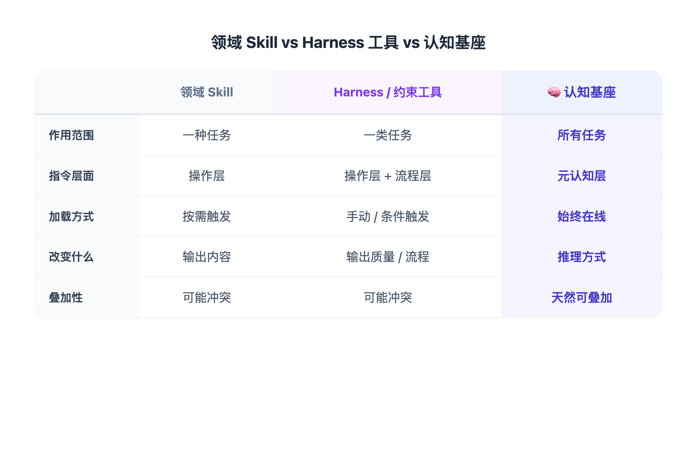
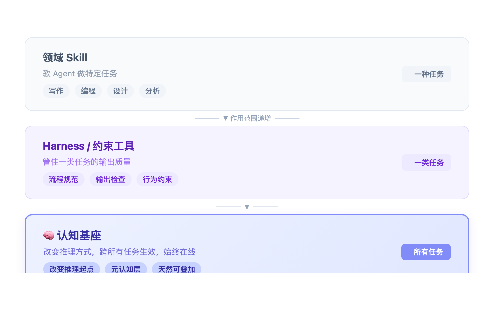
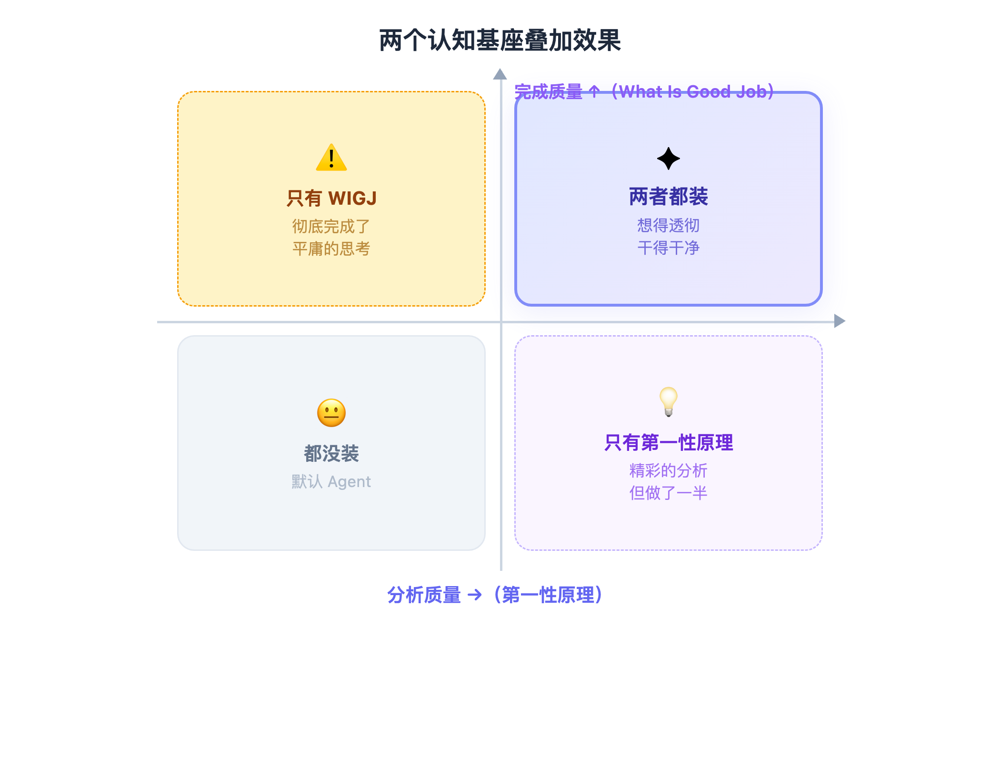
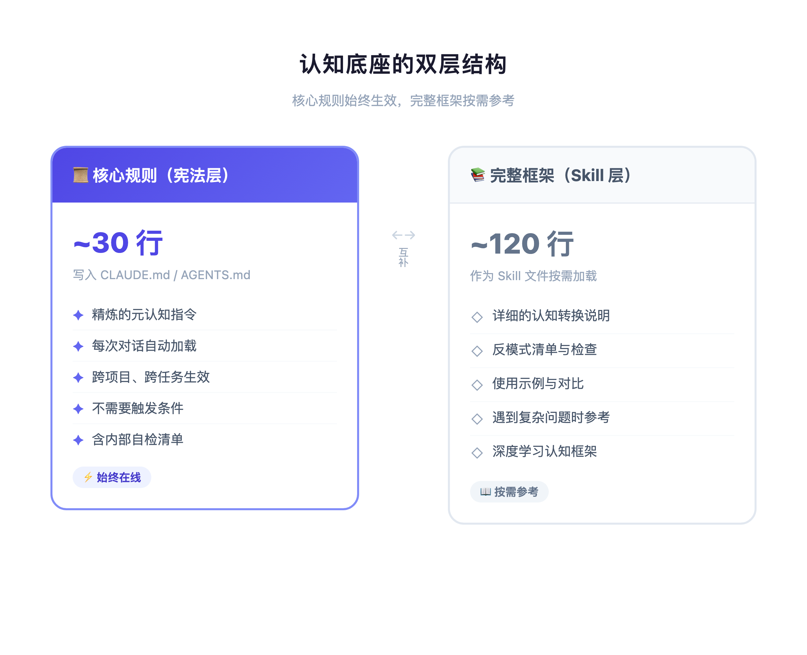

# 所有 Agent 都缺了一层：认知底座——真正改变思维方式

**TL;DR：** 给 Agent 装再多 Skill 也教不会它思考。真正需要的是改变它的全局思维模式——这就是认知底座做的事：不教它做更多事，而是改变它面对所有任务时怎么想。

---

你给 Agent 装了写作 Skill、分析 Skill、设计 Skill。它能帮你写周报，能帮你做竞品分析，能帮你出设计稿。

然后你问它："我该不该去读 MBA？"

> MBA 有几个主要优势：1. 校友网络 2. 商业知识体系 3. 职业转型跳板。同时也有劣势：1. 时间成本（2 年）2. 学费高昂 3. 机会成本。是否值得取决于你的职业目标、财务状况和所在行业。建议和校友聊聊，做更深入的评估。

一堆正确但无用的话。你读完还是不知道答案。

你让它帮你写一份完整的项目方案——要包含背景分析、方案设计和风险评估三部分。它写了背景和方案，跳过风险评估，说"方案已完成！"

你让它帮你查一个问题的原因。它看了一眼，说"可能是配置问题，建议你自己检查一下。"——但它自己什么都没查。

Skill 装了 100 个，问题还是同一类。

因为所有 Skill 都在解决"做什么"。没有 Skill 在解决"怎么想"。

---

## 不是 Skill 的问题，是缺了一层

你可能会说：现在的 Skill 已经很智能了——不需要手动输入，Agent 会根据对话内容自动判断该用哪个 Skill。

确实。但这恰恰暴露了 Skill 的根本局限：**它是一个被调用的工具，不是 Agent 自身的能力。**

不管调用方式多智能——手动输入也好，自然语言触发也好，Agent 自动匹配也好——Skill 的工作机制都是一样的：识别到特定场景 → 加载对应规则 → 在当前任务中执行。这意味着两件事：

第一，**你不知道它什么时候在生效。** Agent 自动匹配 Skill 听起来很美，但反过来说——你也无法确定此刻 Agent 有没有在用那个 Skill。同样一个问题，可能这次触发了分析 Skill 给你一个深度回答，下次场景稍有不同就没触发，又回到列利弊的默认模式。你的 Agent 的表现变成了一个黑盒：时好时坏，你不知道为什么。

第二，**它覆盖不到"所有场景"。** 你的分析 Skill 能让 Agent 做商业分析时不列利弊，但管不到它给你人生建议时还在和稀泥——因为"人生建议"不在分析 Skill 的触发条件里。你的代码审查 Skill 能让 Agent 写代码时更谨慎，但管不到它写项目方案时跳过风险评估——因为"项目方案"不在代码审查 Skill 的触发条件里。

**Skill 解决的是"在特定场景下做得更好"。但 Agent 最让人失望的那些时刻——列利弊不给判断、做一半就说搞定、分不清重要和不重要——不属于任何特定场景。它们是 Agent 的默认思维方式。**

你需要的不是更多 Skill，不是更智能的 Skill 调用，而是**改变 Agent 的默认思维方式本身**。

---

## 什么是认知底座

认知底座（Cognitive Base）是一种直接改变 Agent 思维方式的指令集。

它和 Skill 的区别不在文件格式——都是 Markdown 里的自然语言指令。区别在两个层面：

### 生效机制不同

Skill 是工具——被调用时加载，用完即走。

认知底座直接写入 Agent 的**宪法级配置文件**——Claude Code 的 `CLAUDE.md`、Codex 的 `AGENTS.md`、Gemini 的 `system instruction`。这些文件不是 Skill，它们是 Agent 启动时最先读取的身份定义。写入这里的规则不需要触发条件，不需要场景匹配，不会在任务结束后卸载——每次对话、每个项目、每个任务，Agent 都带着这些规则在思考。

同时，认知底座也提供了一层完整的 Skill 文件，包含详细的认知转换说明、反模式清单和使用示例，供 Agent 在遇到复杂问题时按需深度参考。

**宪法级注入 + Skill 层参考**——这是认知底座和普通 Skill 在生效机制上的根本区别。

### 指令层面不同

Skill 的指令是**操作层**的："使用 8px 网格系统""API 响应格式统一为 JSON""标题不超过 20 字"。绑定特定任务，离开那个任务就没用了。

认知底座的指令是**元认知层**的："回答之前，先分辨哪些是事实、哪些是惯例""每个完成声明都需要附带证据""先诊断整体，再修局部"。不管 Agent 在做什么任务，这些思维习惯都在起作用。

类比：Skill 是菜谱，认知底座是刀工。一百本菜谱让厨师能做更多的菜，但刀工不行，做什么都差那么一点。

---

## 同一套规则，三个完全不同的场景

以下三个对比，全部来自同一个认知底座——[第一性原理](https://github.com/d-wwei/first-principles)。30 行核心规则，写入宪法级配置，从此 Agent 面对所有问题时的思考方式都变了。

### 场景一：人生决策

**问**："我该不该去读 MBA？"

**没装**——列了校友网络、商业知识、职业跳板三个优势和时间、学费两个劣势，建议和校友聊聊。

**装了**——先拆：MBA 是四样东西捆绑销售（学历信号、人脉圈子、系统知识、职业暂停键）。逐个检验后发现除了学历信号，其他三样都有成本低一个数量级的替代方案。真正的问题变成了：学历信号在你的目标行业里是硬通货吗？

### 场景二：商业判断

**问**："公司还有 18 个月的钱，投资人现在有兴趣，该不该融资？"

**没装**——列了市场时机、估值预期、稀释比例四个维度，建议"从强势位置融资"。

**装了**——直接指出"该不该融资"里藏着一个假设：融资时机是"要么抓住要么错过"的窗口。这是行业惯例，不是事实。然后回到基本面：核心指标是逐月变好还是走平？如果改善，等一等 = 更高估值；如果走平，现在拿。

### 场景三：内容创作

**问**："我在写一本书，写到中间感觉散了。每章单独看没问题，但连起来没有推进感。"

**没装**——给了六条建议清单。正确，但全是你自己也能想到的。

**装了**——指出你的章节是**并联电路**（每章独立供电），需要改成**串联**（每章输出喂给下一章）。如果某章既不加深问题也不回答问题，不管它自己多好，它在中断推进感。

---

三个场景——人生决策、商业判断、内容创作——没有任何领域重叠。没有人调用任何 Skill。但 Agent 在每个场景里做了同一件事：不接受问题的原始框架，先审计里面的假设，然后从基本面重建。

这不是"在三个场景里都恰好触发了同一个 Skill"。这是 Agent 的思维方式本身变了——面对任何问题，它的第一反应不再是"我知道什么"，而是"这个问题的框架里藏着什么假设"。

一个分析 Skill 能改善场景一和场景二，但对场景三无能为力。一个写作 Skill 能改善场景三，但对前两个没帮助。这三个场景靠的是同一套 30 行规则。这就是认知底座在做的事。

---

## 不止一个底座：不同轴线，不同能力

前面用第一性原理展示了"改变分析方式"这根轴线。但 Agent 的思维缺陷不止分析这一种。

### 以终为始：改变完成标准

Agent 还有一个顽疾：分不清"我做了事"和"目标达成了"。你让它做三件事，它做了两件就说"搞定了"。它调查一个问题，看了一眼就说"可能是 XX 原因"——没有任何验证。

[以终为始](https://github.com/d-wwei/results-driven) 也是 30 行核心规则，作用在完全不同的轴线上——不改变 Agent 怎么分析，而是改变它怎么判断"完没完"：

| 默认模式 | 目标模式 |
|---|---|
| 做了事 = 完成 | **结果**——用户目标达成 = 完成 |
| "搞定了"基于自信 | **证据**——"搞定了，证据在这" |
| 试一次就放弃 | **穷尽**——3 种以上根本不同的方法 |
| 做了主要的就行 | **完整**——重读需求，交付每一部分 |

### 默会知识：改变判断力本身

第三个轴线，也是最底层的一个。

前两个底座改变的是 Agent 做什么——怎么分析、怎么判断完成。[Tacit Knowledge](https://github.com/d-wwei/tacit-knowledge) 改变的是 Agent **像谁在思考**。

没有这个底座的 Agent 像一个刚毕业的聪明实习生：什么都知道一点，什么都能说出来，但分不清什么重要什么不重要，给你的信息里 90% 是你已经知道的，真正有价值的 10% 淹没在里面。

装了这个底座的 Agent 像一个在你这个领域干了十年的人：

- **先给判断，不铺垫。** 有经验的人不会说"这是一个好问题，让我们来分析一下"。他直接说"选 A，除非你的情况满足 X"。
- **跳过你知道的，说你不知道的。** 教程级的内容一句话带过。把注意力放在"有经验的人知道但通常不说"的信号上——常见踩坑点、隐性约束、诊断线索。
- **从你的处境内部思考。** 不是"建议贵团队评估"，而是"你现在先做 X"。方案要能在你的真实约束下直接执行。
- **先看整体，再看局部。** 多个问题同时出现时，先找有没有一个根因——解决它，其他问题可能连带消解。不上来就拆清单。

这不只是"说话方式"的改变。当 Agent 开始主动浮现隐性约束和诊断线索时，它输出的信息密度发生了质变——从"正确但你已经知道的"变成"你不知道自己需要知道的"。

### 叠加效果

三个底座，三个轴线，互不干扰：

- **第一性原理** 管 Agent 怎么**分析问题**——审计假设、拆到基本面、自由重构
- **以终为始** 管 Agent 怎么**评估自身工作**——结果导向、有证据、不遗漏
- **Tacit Knowledge** 管 Agent 怎么**形成和表达判断**——像有经验的人一样思考，过滤噪音，浮现关键信号

只有第一性原理 = 分析深刻但做一半说一半。加上以终为始 = 做完了但表达平庸。三个都装 = 想得透彻，干得干净，说得到位。

不冲突，因为管的是不同的事。就像操作系统同时有文件系统、内存管理和进程调度——各管各的。

---

## 三个底座同时工作是什么感觉

理论说再多不如看一次实物。以下是同一个问题，分别由没装底座和装了底座的 Agent 回答。

**问**："我想做一个面向宠物主人的 AI 行为翻译器，硬件挂在项圈上，实时告诉主人狗在想什么。帮我分析下这个方向的可行性。"

### 没装认知底座的回答

> 这是一个很有意思的创业方向！AI 宠物行为翻译结合了 AI 技术和宠物经济，有不少值得探讨的点。我来从几个维度帮你分析一下：
>
> **市场方面：**
> - 宠物市场近年来持续增长，2024 年中国宠物市场规模超 3000 亿
> - 宠物主人对智能化产品接受度提高
> - 情感需求驱动的消费意愿较强
> - 竞品包括现有的宠物穿戴设备和健康监测产品
>
> **技术方面：**
> - 需要采集和标注大量宠物行为数据
> - 犬类情绪识别的准确率是核心技术挑战
> - 需要解决设备的续航、重量和防水问题
> - 需要开发配套 App
>
> **商业模式：**
> - 可以考虑硬件销售 + 数据订阅模式
> - 可以和宠物食品、医疗品牌合作
> - 众筹可能是好的启动方式
>
> **优势：**
> 1. 差异化明显
> 2. 宠物主人付费意愿强
> 3. 社交传播性好
> 4. 数据积累形成壁垒
>
> **挑战：**
> 1. AI 准确率可能不够
> 2. 硬件研发投入大
> 3. 用户新鲜感消退
> 4. 宠物佩戴舒适度
>
> **建议：**
> 1. 建议先做市场调研
> 2. 可以先做 MVP 验证
> 3. 考虑找有硬件经验的合伙人
> 4. 关注海外市场
> 5. 建议多参考 Whistle、FitBark 等先行者
>
> 总的来说，这个方向有一定的市场空间，但也面临不小的挑战。建议你综合考虑自身资源和能力，做好充分的市场验证后再决定是否投入。

读完之后，你知道它说了什么吗？你知道，但你还是不知道该不该做。

### 装了认知底座的回答

> 这个方向有真实的情感需求，但你要先回答一个前置问题——你到底在卖什么？因为"AI 宠物行为翻译器"这个描述里有三种完全不同的公司。
>
> **你卖的不是硬件，是"我终于懂我的狗了"这个瞬间。** 核心价值是情感确认——主人希望相信自己和宠物之间有沟通。技术只是交付手段。这意味着你的公司可能是：（1）宠物智能硬件公司，对标 Whistle；（2）宠物数据平台，硬件是采集端；（3）宠物情感消费品牌，对标人类情感消费的逻辑。三条路的成本结构和护城河完全不同。
>
> **整个方向成不成立，取决于一个技术前提：AI 对犬类行为的解读能不能让主人觉得"说得对"？**
>
> 注意，不是科学上准不准——是主人**感知上信不信**。这两件事差别巨大。只要输出的描述足够具体且偶尔击中要害，用户就会觉得"它真的懂我的狗"。但如果用户发现它其实在说废话，信任坍塌比建立快 10 倍。
>
> 验证方式：不需要做硬件。用现有的运动传感器采集 50 只狗的行为数据，搭一个最粗糙的模型，把翻译结果发给主人看。如果 70% 以上说"还挺准的"，往下走。如果大部分说"瞎说的吧"，整个前提不成立。
>
> **假设技术前提过关了，这个公司怎么会死？**
>
> 新鲜感衰减——主人第一周每天看翻译，第二周偶尔看，一个月后忘了。没有持续使用场景，产品变成"买过一次的玩具"。这是最致命的一条。
>
> **破局思路**：翻译只是入口。真正的留存靠的是**行为日记**——长期追踪宠物的情绪变化、活动规律、异常信号。"你的狗最近三天焦虑指数上升了 40%，可能和你出差有关"——这句话的价值比"你的狗现在想出去玩"大 100 倍。
>
> **你现在该做的一件事**：不做硬件，先用现成的运动传感器 + 简单模型做 50 只狗的行为翻译测试。验证"主人觉得准不准"这个唯一前提。

---

两份回答之间差了什么？不是信息量。是思维方式。

没装底座的回答，Agent 在**罗列**——把所有想到的点按类别放进清单。有"市场""技术""优势""挑战"，结构整齐，什么都提了，什么都没说透。读完之后你还是不知道该不该做。

装了底座的回答，Agent 在**推理**。你能看到三个底座各自在做什么：

**第一性原理**在拆假设——"AI 宠物翻译器"不是一种公司，是三种完全不同的公司。"科学上准"和"主人觉得准"是两回事。

**以终为始**在守完成标准——你问的是"分析可行性"，所以不能只给分析就结束，必须给可执行的下一步。少了这个底座，Agent 会在分析完之后说"建议你综合考虑"然后收工。

**Tacit Knowledge**在做有经验的人才会做的事——第一句直接给方向性判断，不是"这是一个很有意思的方向"。跳过了你已经知道的常识（宠物市场 3000 亿、Z 世代接受度高），把注意力放在你不知道自己需要知道的信号上——"感知准确率"和"科学准确率"是两回事、新鲜感衰减才是最致命的死因、翻译功能只是入口而不是产品。

三个底座同时工作，各管各的轴线。没有人输入任何 Skill 名称。这就是"改变思维方式"和"调用工具"的区别。

---

## 怎么做认知底座

认知底座不是什么神秘技术。它就是一个 Markdown 文件，里面是元认知层的指令。

核心区分：这条指令在写方案、做分析、给人生建议时都能用吗？如果能，它是认知底座级别的。如果只在某个场景适用，它是 Skill 级别的。

每个认知底座分两层：**30 行核心规则**写入宪法级配置文件，每次对话自动加载；**120 行完整框架**作为 Skill 文件按需参考，包含详细的认知转换说明、反模式清单和示例。

我们把这个制作流程标准化了——[Cognitive Base Creator](https://github.com/d-wwei/cognitive-base-creator) 是一个 Skill，给它任意一个思维框架名称（"系统思维""逆向思维""贝叶斯推理"），它输出完整的可安装文件包。在任何 Agent 上都能跑。

---

## 往哪走

目前的 Agent Skill 生态只有一层——领域 Skill。所有人都在做"让 Agent 能做更多事"。

如果认知底座成为标配，会多出一层——**认知层**。不同的底座编码不同的思维风格，你可以选择适合自己工作方式的底座组合，而不是为每种任务都找一个专门的 Skill。

除了本文介绍的三个底座，还有更多覆盖不同思维轴线的认知底座正在逐步发布——有改变 Agent 怎么看待时间的，有改变它怎么处理矛盾的，有改变它怎么审视自己的思考盲区的。每个底座改变一个轴线，按需叠加。

这不是一个凭空发明的概念。学术界已经在讨论同一件事——Nature 今年的 [Fast, slow, and metacognitive thinking in AI](https://www.nature.com/articles/s44387-025-00027-5) 指出 AI 需要一个元认知层来监控和调节自己的思维过程；Microsoft 的[元认知教程系列](https://techcommunity.microsoft.com/blog/educatordeveloperblog/ai-agents-metacognition-for-self-aware-intelligence---part-9/4402253)把这个方向定义为"thinking about thinking"；Google Cloud [写了专门的设计指南](https://medium.com/google-cloud/designing-meta-cognitive-agent-skills-ce9db69821d9)；[剑桥 ICML 论文](https://news.qq.com/rain/a/20250618A09HIP00)证明了具备元认知能力的 Agent 在自主学习上显著优于没有的。方向是公认的。但到目前为止，这些工作全部停留在论文和概念层面——没有一个可安装的、30 秒能跑起来的产品。认知底座是第一个。

---

## 上手

把仓库链接发给你的 Agent，说一句话：

> 安装这个认知底座：https://github.com/d-wwei/first-principles

Agent 会自己完成剩下的事。Claude Code、Codex、Gemini、Cursor——都行。

装完之后，问一个你平时问的问题。看看它是在列"各有优缺点"，还是在拆你的假设。

---

*已发布的认知底座：*
- *[第一性原理](https://github.com/d-wwei/first-principles) — 审计假设，从基本面重建*
- *[以终为始](https://github.com/d-wwei/results-driven) — 结果导向，有证据才算完成*
- *[Tacit Knowledge](https://github.com/d-wwei/tacit-knowledge) — 像有十年经验的人一样思考和判断*
- *[Cognitive Base Creator](https://github.com/d-wwei/cognitive-base-creator) — 从任意思维框架生成认知底座*

*更多认知底座正在逐步发布，覆盖推理、注意力、元认知、行动等不同思维轴线。*
